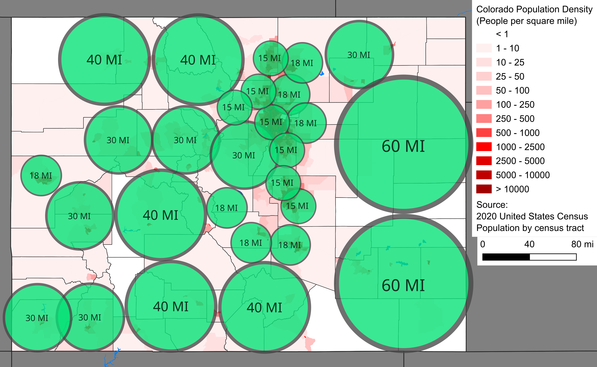
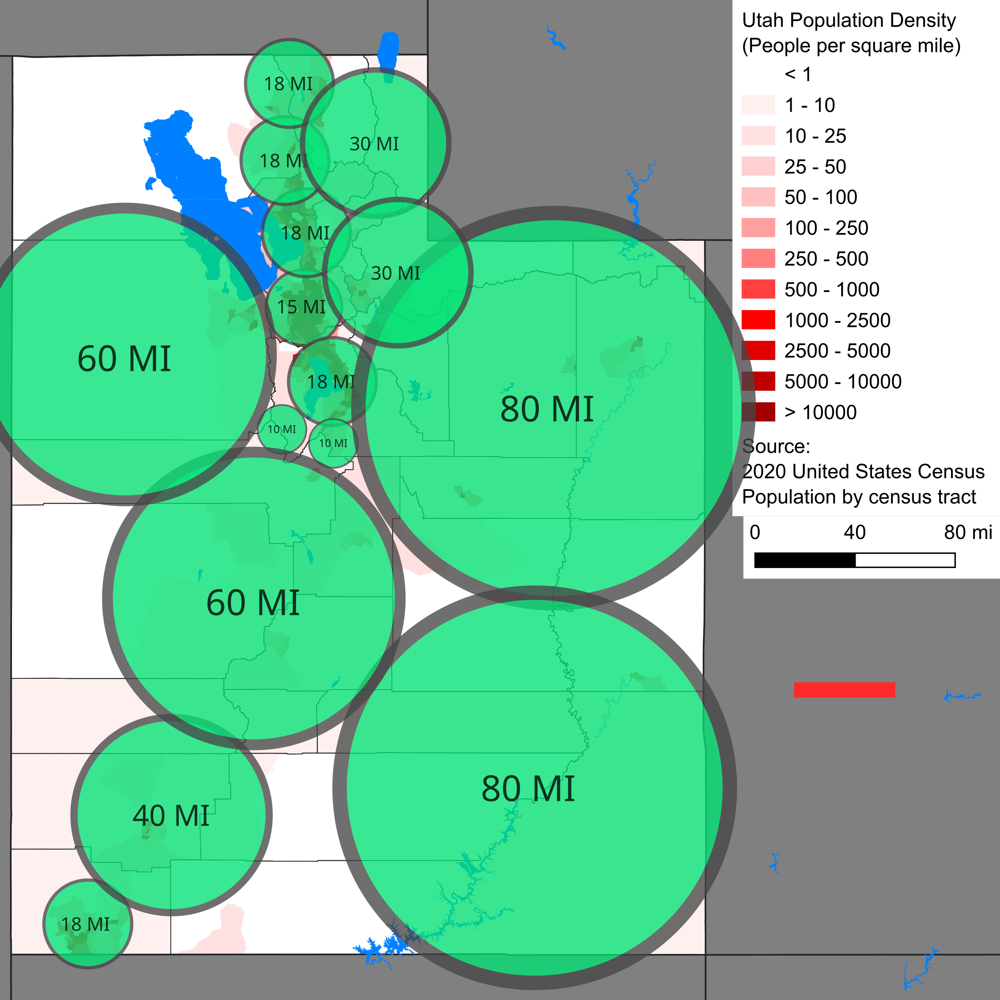

# DS 2500 - RentCast Data Collection Script
A Python script I made to complete my final data analysis project for my DS 2500 class at the University of Utah. This script was programmed and designed to gather housing data from Utah and Colorado to later be used for analysis. It uses the RentCast API to gather data from these states.

It only collects data in with the following properties/aspects:
1. Is an active house listing
2. Is a Single Family designation for the home
3. Does not contain missing data on any columns

 

---

 

All the data that was collected from executing this script is only accessible to my professor (and any people who have access to my google drive). This is to comply with the terms of service that RentCast outlines. The script collects the following metrics on houses:
- **ID** : RentCast ID of the property.
- **State** : State the property is located in. UT and CO are the only configured states.
- **County** : What county of the state the property is located in.
- **City** : The city that the property is located in.
- **Zip** :  Zip code of the property.

- **Square Footage** :  How many square feet the property has.
- **Bedrooms** : How many bedrooms the property has.
- **Bathrooms** :  How many bathrooms the property has.
- **Lot Size** :  How large the lot is that the property is sitting on. Measured in square feet.
- **Price** : The listing price of the property in USD.

- **Year Built** : What year the property was built.
- **Listing Date** : What the listing date is for the property.

 

---

### Some Things to Note:
##### The script itself is fairly fast and designed to be as stable and descriptive as possible during its execution. But here are some things to note:
- It attaches to a MySQL database and stores all the data it collects in there as it goes. See the init.sql file to see what the database structure looks like

- If the API requests return data that has missing or incorrect JSON keys, it will not add the property to the database. But it will log it in the output logs.

- On that note, in my experience of running this script. New construction homes tend to not have year_built or lot_size fields. Those homes are skipped over.

- It makes one API request every 3 seconds. This is much smaller than the rate limit, but allows for easy human intervention. At that rate, it collects roughly 10,000 homes per minute.

 

---

 

As I said earlier, my analysis was only done on Colorado and Utah. Here are images of the what areas I collected data from. As you can see I chose latitude and longitued points and pulled data from houses in each of those circular regions. Each region has a label that denotes the radius. The reason that I had to go with this approach was because I wanted to collect as much data in as few API requests as possible, since it costed money.

So I chose specific regions and simply put a radius around them. Smaller radii are chosen in more densely populated areas and vice-versa. This was to improve the granularity of the data collection in case the API had a limiter put in place behind the scenes.

 
 

